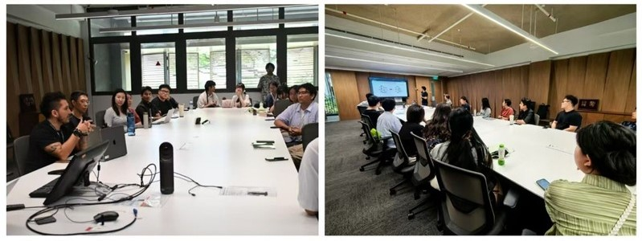

Dr. Jinda Qi, Principal Investigator of SmartScape Design Lab, participated in the Universitas 21 (U21) Early Career Researcher Workshop 2025, held at the University of Nottingham, UK. The workshop brought together early career researchers from U21 member universities across disciplines for cross-disciplinary collaboration and knowledge exchange.

The 2025 workshop centred on the theme of health across the life course, exploring topics including healthcare quality, health disparities, well-being through social systems, environmental factors, sustainability, and global health challenges. Participants engaged in small-group workshops, poster sessions, lightning talks, and panel discussions with established researchers from around the world.

