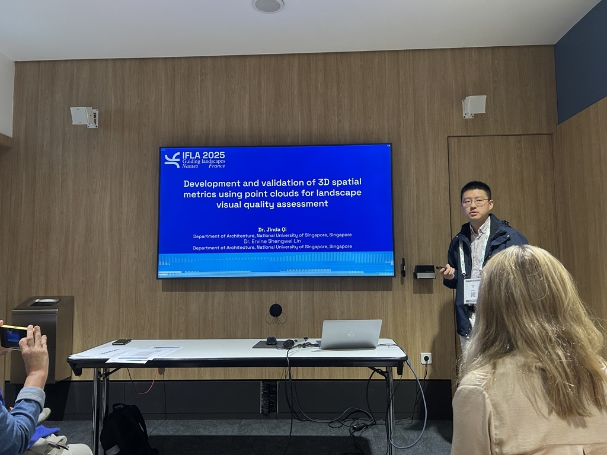

SmartScape Design Lab presented research at the IFLA World Congress 2025 in Nantes, France. Under the congress theme “Guiding Landscapes,” Dr. Qi Jinda, Principal Investigator of SmartScape Design Lab, shared the study “Development and Validation of 3D Spatial Metrics Using Point Clouds for Landscape Visual Quality Assessment.”

The presentation highlighted the lab’s ongoing research on point clouds, spatial metrics, and landscape visual quality assessment, contributing to international discussions on data-informed landscape analysis and design.

