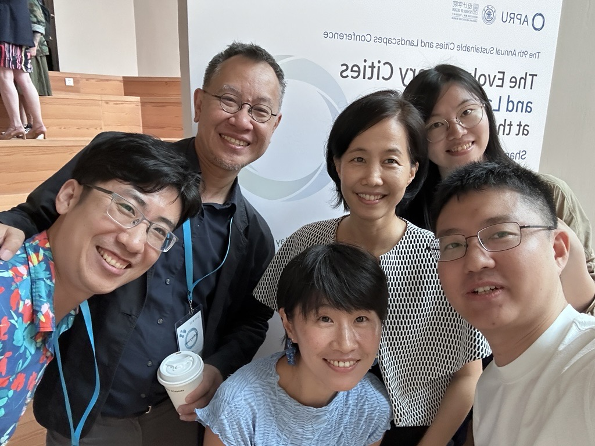

Dr. Jinda Qi, Principal Investigator of SmartScape Design Lab, attended the 9th Annual APRU Sustainable Cities and Landscapes Conference, held at Shanghai Jiao Tong University in Shanghai, China. The conference, themed "Evolutionary Cities and Landscapes in the Pacific Rim," brought together researchers, practitioners, and policymakers from APRU member universities to advance interdisciplinary dialogue on sustainable urban development, landscape design, and climate-responsive approaches to cities.

